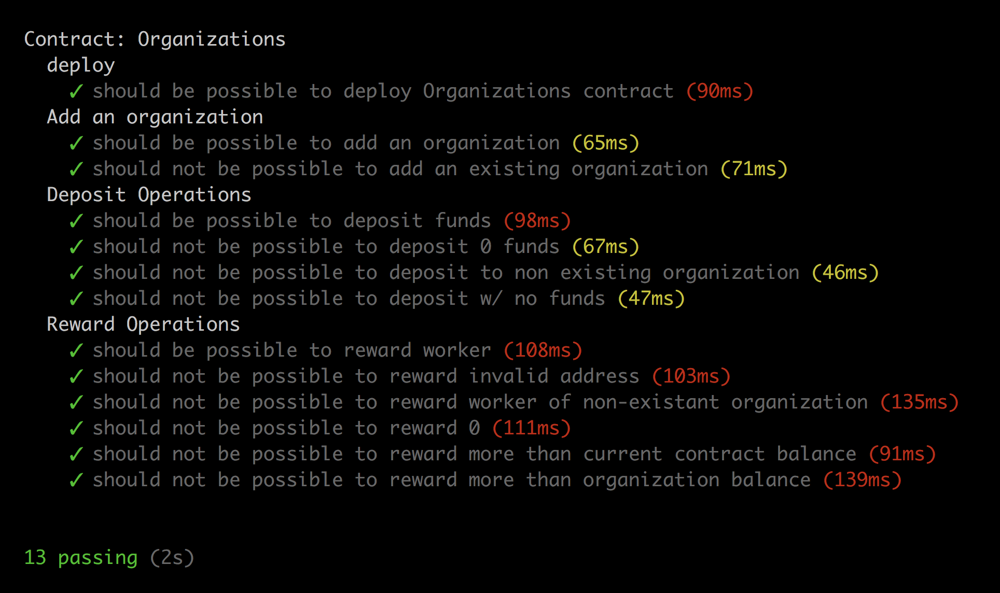

# Contracts

This repo contains the contract `Organization.sol`.

## Organization.sol
This is the main contract the an organization will interact with.

### Public methods
1. `addWorker(address _worker)` -> Add a worker/member to your workforce.
2. `removeWorker(address _worker)` -> Remove a worker/member from your workforce.
3. `rewardAmount(address _worker, uint rewardAmount)` -> Reward a worker/member of your workforce.
4. `deposit` -> Deposit more ETH into the contract

## Currently passes the following tests

